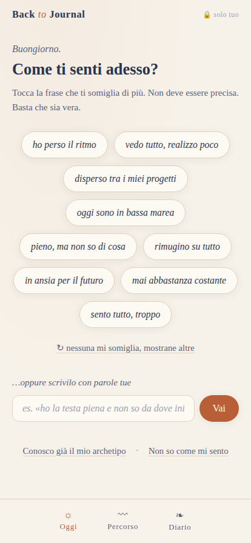
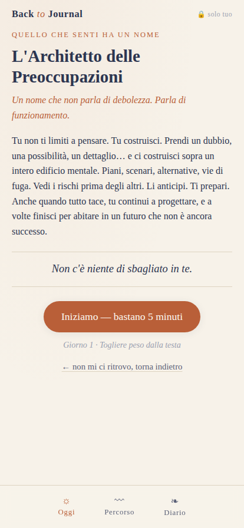
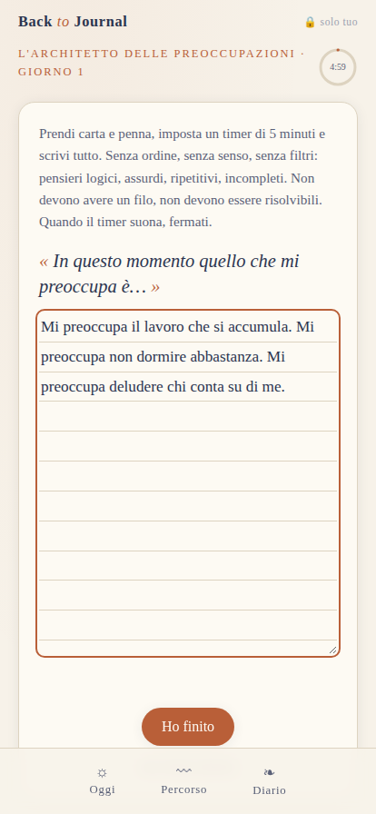
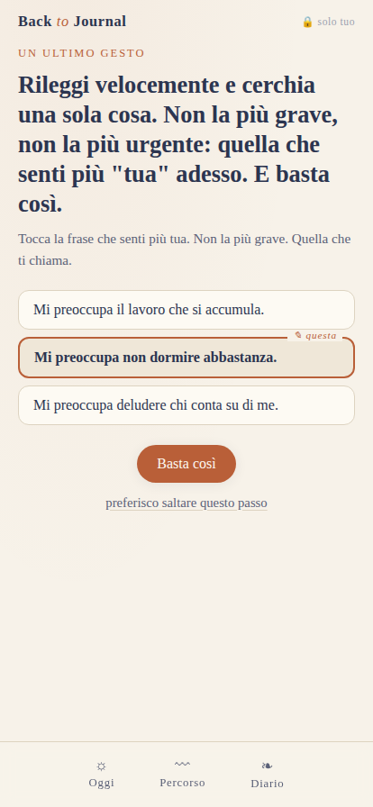
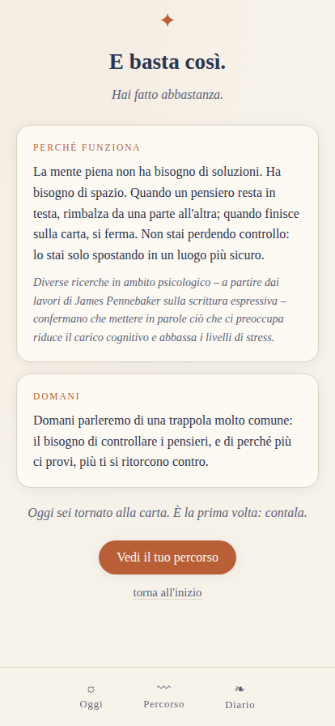
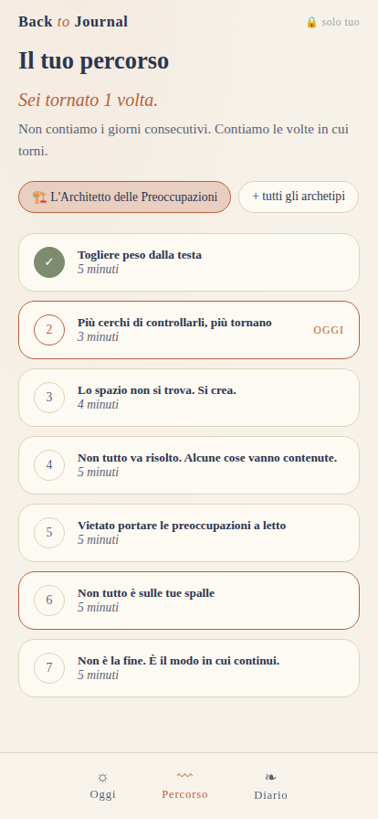
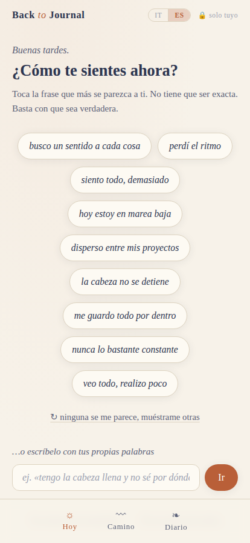
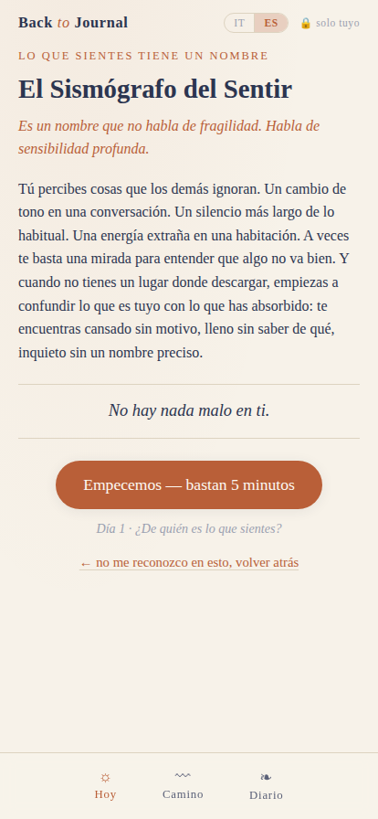

# BTJapp — Back to Journal

App de journaling terapéutico guiado, basada en el método y los 9 arquetipos de [backtojournal.it](https://www.backtojournal.it/).

**La idea en una frase:** partes de *cómo te sientes ahora* (globos de emociones o texto libre), la app te reconoce en tu arquetipo y te guía en un ejercicio de escritura de 5 minutos — frase de apertura, timer suave, ritual de cierre y el porqué científico. Disponible en **italiano y español**, con selector de idioma en la barra superior. **Papel primero**: la app acompaña el cuaderno, no lo reemplaza — cada sesión pregunta si escribes ahí o en pantalla, y el ritual de cierre funciona en los dos casos.

📄 El diseño completo está en [`docs/DISENO.md`](docs/DISENO.md).

## Así se ve

| Check-in | Rispecchiamento | Escritura guiada |
|---|---|---|
|  |  |  |

| Ritual de cierre | Cierre | Percorso |
|---|---|---|
|  |  |  |

| Check-in en español | Rispecchiamento en español |
|---|---|
|  |  |

## Probar la app

No hay build ni dependencias: es una SPA estática.

```bash
# opción 1: abrir directamente
open index.html

# opción 2: servidor local
python3 -m http.server 8000
# → http://localhost:8000
```

Funciona también publicándola tal cual en GitHub Pages / Netlify.

## Estructura

```
index.html               pantallas de la app (check-in, sesión, percorso, diario)
css/app.css               estética papel y tinta; tipografía Braveold/Mogena/Inter self-hosted
fonts/*.woff2             Braveold (títulos), Mogena (wordmark), Inter (cuerpo) — sin CDN
js/i18n.js                selector de idioma: t(), aplica traducciones estáticas, persiste preferencia
js/app.js                 orquestador: globos, matcher de texto libre, navegación
js/session.js             motor de la sesión: pasos, timer, bifurcación papel/pantalla, control, ritual
js/quiz.js                mini bussola/brújula: 4 preguntas → arquetipo
js/storage.js             persistencia local (localStorage) — privacidad primero
data/strings.js           todos los textos de interfaz, en italiano y español
data/greetings.js         saludos del primer acceso del día + frases que invitan a escribir (IT/ES)
data/emotions.js          globos de emociones + léxico (IT/ES) del matcher de texto libre
data/archetypes.js        contenido de los 9 arquetipos en ambos idiomas (GENERADO — no editar a mano)
data/extracted/*.json     contenido original en italiano, fiel a los documentos fuente (Drive)
data/extracted-es/*.json  traducción al español (misma estructura, mismos ids)
scripts/build_data.py     regenera data/archetypes.js desde ambas carpetas extracted*
```

## Contenido

El contenido (descripciones de arquetipos, frases de apertura de los ejercicios, rituales, referencias científicas) proviene de las secuencias de email de 7 días de Back to Journal, extraído verbatim en italiano y traducido fielmente al español preservando el tono cálido y en segunda persona. Para actualizarlo: reemplazar los JSON en `data/extracted/` (IT) y/o `data/extracted-es/` (ES) y ejecutar `python3 scripts/build_data.py`.

### Idiomas

El selector IT/ES vive en la barra superior y funciona en cualquier pantalla, incluso a mitad de una sesión de escritura: el texto que ya escribiste nunca se traduce (es tuyo), solo cambian los textos de la interfaz y del ejercicio. La preferencia de idioma se guarda en el dispositivo. Los rituales de cierre (encerrar una frase, subrayar una palabra, marcar Ⓜ/Ⓐ, sello de cierre) se reconocen automáticamente en ambos idiomas gracias a las mismas palabras disparadoras traducidas de forma consistente.

### Papel o pantalla

Al empezar cada sesión, la app pregunta dónde vas a escribir. En pantalla, todo funciona como antes (textarea, ritual de tocar/subrayar/marcar). En papel, la caja de texto se reemplaza por un recordatorio breve; al final, el ritual pide traer de vuelta la palabra o frase que encerraste en el cuaderno — así el gesto de cierre sobrevive aunque no se haya tipeado nada. También hay una pregunta opcional, "¿cuánto de esto depende de ti?": si la respuesta es "casi nada", el cierre cambia de marco — de empujar hacia un próximo paso a solo acompañar, sin pedir ninguna acción.

### La app te recuerda

La primera vez que abres la app cada día, un saludo más cálido y una frase breve que invita a escribir reemplazan el saludo simple de siempre — ambos rotan entre varias opciones, y no vuelven a aparecer ese mismo día. Y cuando reconoces un arquetipo en el que ya estuviste antes, la pantalla de reconocimiento recuerda cuándo fue la última vez y, si trajiste una palabra o frase de esa sesión, te la devuelve: *"La última vez que te sentiste así fue hace 3 días. Te llevaste contigo: «...»"*. Todo esto vive solo en tu dispositivo — nada se envía a ningún lado.

## Principios

- **Papel primero** — la app acompaña el cuaderno; no lo reemplaza.
- **La emoción es la puerta; el arquetipo es el motor** — se entra por cómo te sientes, no eligiendo un arquetipo.
- **Senza pressioni** — sin rachas ni culpa: se cuentan las *veces que vuelves*, nunca los días seguidos que faltaste.
- **Privacidad radical** — todo se guarda en el dispositivo (localStorage), y cuanto menos texto sensible se guarde, mejor; exportable a `.txt`.
- **Un ejercicio pequeño cada vez** — nunca una lista de tareas pendientes.
